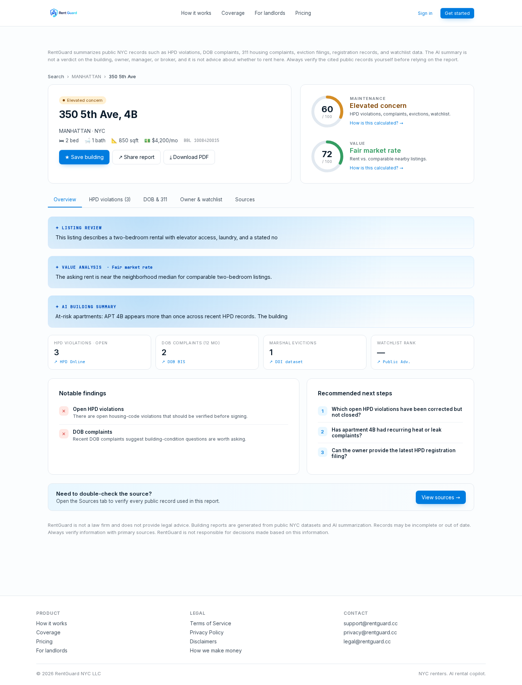
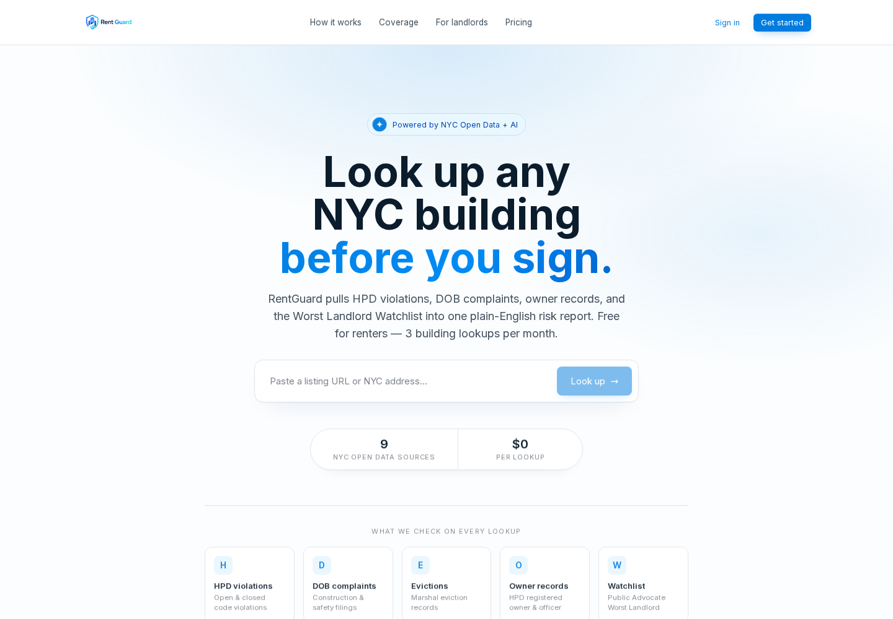
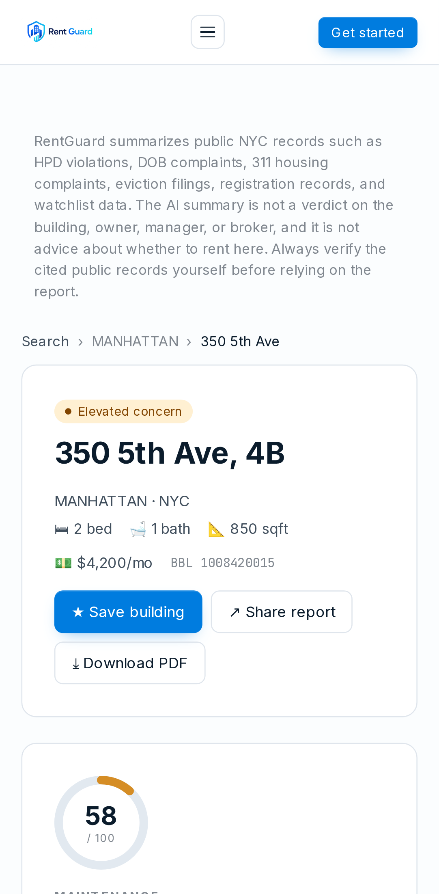

# RentGuard NYC

**Free AI-powered building risk reports for NYC renters.**

[](https://github.com/dup7047/RentGuardAI/actions/workflows/backend-ci.yml)
[](https://github.com/dup7047/RentGuardAI/actions/workflows/frontend-ci.yml)
[](https://github.com/dup7047/RentGuardAI/actions/workflows/frontend-ui-ci.yml)

**🌐 Live at [rentguard.cc](https://www.rentguard.cc)**

Paste any NYC address — or a StreetEasy/Zillow listing URL — and RentGuard pulls HPD violations, DOB complaints, 311 housing complaints, marshal evictions, owner registrations, and the Public Advocate's Worst Landlord Watchlist from NYC Open Data, scores the building, and streams a plain-English AI summary where every claim links back to the source record.



<table>
  <tr>
    <td width="62%">
      
    </td>
    <td width="38%">
      
    </td>
  </tr>
</table>

*Report screenshots show demo data from the e2e fixtures, not real records for the pictured address.*

## What it does

- **Free building lookup** — 3 lookups/month, email-gated after the first; signed-in users can save buildings to a dashboard
- **Sourced AI summaries** — the model is constrained to the retrieved public records, and every report links each finding to its NYC.gov source; reports are informational, never advice
- **Listing URL support** — StreetEasy/Zillow URLs are scraped and geocoded to the underlying building
- Lease review, paid alerts, and FARE Act tooling are deliberately waitlist-only while the free lookup proves out

## How it works

1. **Geocode** the address (or extract it from a listing URL) via NYC GeoSearch
2. **Fan out** to 8 NYC Open Data endpoints (HPD, DOB, 311, evictions, registrations, watchlist) with a Postgres cache in front
3. **Score** the building deterministically with a factor breakdown (violations, complaints, evictions, watchlist status)
4. **Summarize** with OpenAI, constrained to the retrieved facts, with per-route cost caps and a usage ledger
5. **Stream** the report to the client as NDJSON with phase-by-phase progress

## Architecture

| Layer | Stack |
|---|---|
| Frontend | Next.js 15 / React 19 on Vercel — App Router, streamed lookups, ISR'd building pages, OG image generation |
| Backend | Hono on Render (Node 20) — structured pino logging, zod-validated routes, standardized error envelopes |
| Data | Supabase Postgres + Drizzle ORM — RLS on every table, migrations in version control, CI-validated |
| Auth | Supabase Auth — magic link + password, PKCE, SSR session handling |
| AI | OpenAI with cost caps and an `ai_usage` ledger |
| Email | Resend (transactional) + Cloudflare Email Routing (aliases) |

## Engineering quality signals

- **Database-level security**: row-level security on every table, with integration tests that assert denial under both `anon` and `authenticated` Postgres roles ([`backend/drizzle/0002_phase_1_3_security.sql`](backend/drizzle/0002_phase_1_3_security.sql), [`backend/test/`](backend/test/))
- **CI migrates against a real local Supabase stack** on every backend PR — schema changes are exercised, not assumed ([`.github/workflows/backend-ci.yml`](.github/workflows/backend-ci.yml))
- **Nightly Playwright matrix** across 7 browser/device profiles plus per-PR smoke tests ([`.github/workflows/frontend-ui-ci.yml`](.github/workflows/frontend-ui-ci.yml), [`frontend/e2e/`](frontend/e2e/))
- **Backup/restore runbook** with a 44-assertion `verify:restore` script and a documented full restore drill ([`backend/RUNBOOK.md`](backend/RUNBOOK.md))
- **Structured logging**: JSON pino logs with per-request IDs, method/path/status/duration on every request ([`backend/src/logger.ts`](backend/src/logger.ts))
- **Strict TypeScript on both ends**; 9 runtime backend dependencies
- **Security posture documented**: auth-flow audit with OWASP/CWE mapping ([`docs/auth-validation.md`](docs/auth-validation.md)) and a public security policy ([`SECURITY.md`](SECURITY.md))
- **Legal copy as code**: attorney-approved disclaimers compiled into the UI at build time, with byte-for-byte snapshot tests and a marketing-copy compliance audit ([`docs/legal/`](docs/legal/), [`frontend/scripts/build-disclaimers.ts`](frontend/scripts/build-disclaimers.ts))

## Repository layout

```
RentGuardAI/
├── backend/              # Hono API — routes, NYC Open Data ingestion, scoring, AI, scraping
│   ├── drizzle/          # migrations (schema + hand-written RLS policies)
│   ├── test/             # vitest unit + DB integration suites
│   ├── scripts/          # verify-restore, verify-data-sources, stripe-setup, watchlist import
│   └── RUNBOOK.md        # backup/restore procedures, RTO/RPO targets
├── frontend/             # Next.js 15 app — lookup flow, building reports, auth, dashboard
│   ├── e2e/              # Playwright suites + self-contained mock backend
│   └── test/             # vitest component/unit tests
├── supabase/             # local CLI config + branded auth email templates
├── docs/                 # data-source inventory, runbooks, legal docs, phase history
└── render.yaml           # Render service blueprint
```

## Local development

Requires Node 20+, Docker, and the [Supabase CLI](https://github.com/supabase/cli).

```sh
supabase start                # local Postgres + auth on :54322, Studio on :54323

cd backend
cp .env.example .env
npm install
npm run migrate               # apply drizzle migrations
npm run dev                   # http://localhost:8080
npm test && npm run typecheck

cd ../frontend
cp .env.example .env.local
npm install
npm run dev                   # http://localhost:3000
npm test
npm run e2e:smoke             # Playwright smoke matrix vs mocked backend
```

Database changes: edit `backend/src/db/schema.ts`, then `npm run db:generate && npm run migrate`. To run migrations against a remote Supabase project, pass its `DATABASE_URL` to `npm run migrate`.

Deployment: the backend deploys to Render from [`render.yaml`](render.yaml) (free tier — first request after idle takes ~30s); the frontend deploys to Vercel with Root Directory set to `frontend/`. Operational guides live in [`backend/RUNBOOK.md`](backend/RUNBOOK.md) and [`docs/runbook/`](docs/runbook/).

## Project history

The product was built in phases against a private roadmap, each phase with explicit acceptance criteria — preserved in [`docs/phase-history.md`](docs/phase-history.md).

## Status & license

The production service at [rentguard.cc](https://www.rentguard.cc) is operated by the author. Source is available for review; no open-source license is granted.
